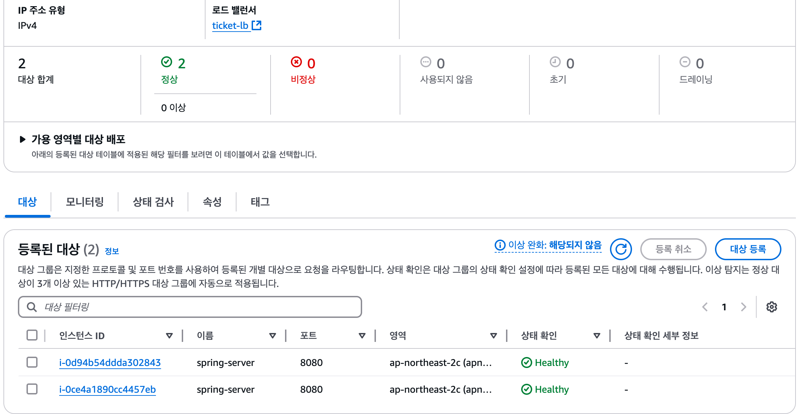
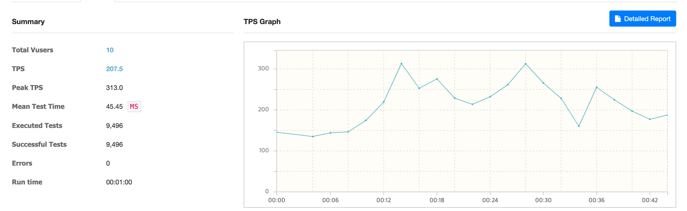
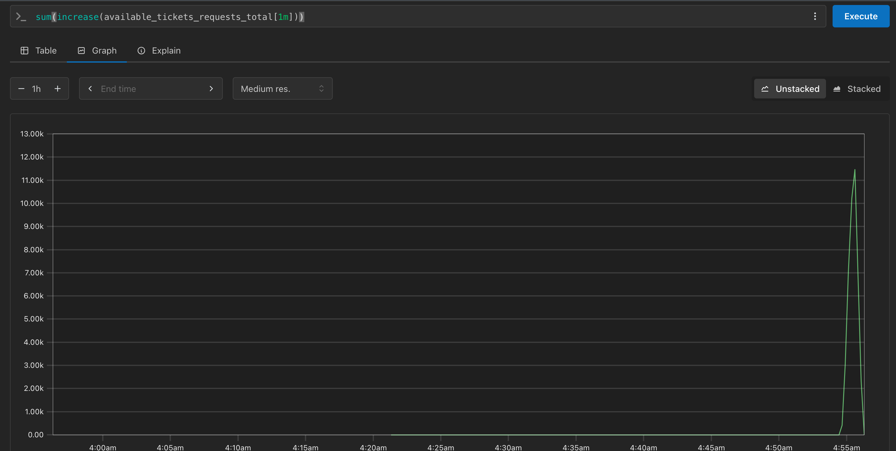
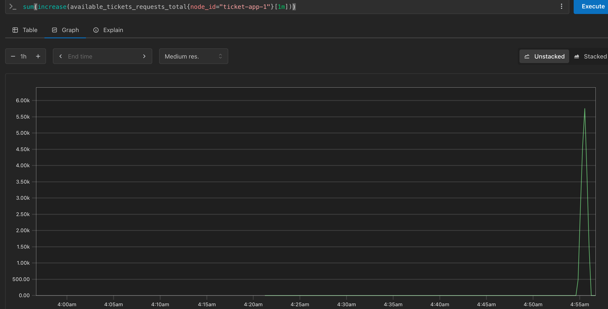
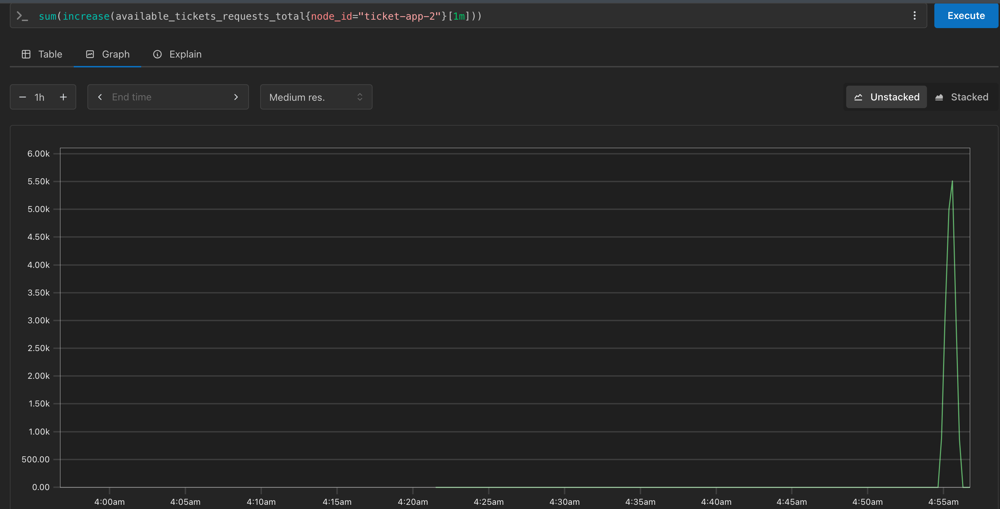

# 트래픽 분산을 위한 로드밸런서 설정

## 1. AWS Application Load Balancer (ALB)

### 1.1 ALB 를 사용한 이유

- 현재 서비스는 EC2 인스턴스를 사용하여 서비스를 제공하고 있기 때문에 AWS의 로드밸런서 서비스인 ALB를 사용하여 트래픽을 분산하고자 하였습니다.
- 왜 Nginx 와 같은 서버를 사용하지 않고 ALB를 사용하였는지에 대한 이유는 다음과 같습니다.
  - 현재 프로젝트에서는 Terraform으로 서버를 배포하고 있는데, 코드로 쉽게 설정할 수 있기 때문입니다.
  - ALB는 트래픽 양에 따라 자동으로 확장 및 축소할 수 있습니다. Nginx는 수동으로 처리해야하는 불편함이 있습니다.
  - ALB는 다양한 메트릭을 모니터링할 수 있으며, 로그를 통해 트래픽 분석과 이슈 해결에 용이합니다.


### 1.2 ALB 설정

- ALB 보안 그룹을 설정 (http 포트인 80번 포트를 열어줍니다.)
```hcl
# ALB 보안 그룹
resource "aws_security_group" "alb_sg" {
  vpc_id = data.aws_vpc.default.id
  name   = "alb-secure-group"

  ingress { // inbound 트래픽을 설정 
    from_port   = 80
    to_port     = 80
    protocol    = "tcp"
    cidr_blocks = ["0.0.0.0/0"] // 현재는 모든 IP를 허용, 보안을 위해 특정 IP만 허용할 수 있다. 
  }

  egress {
    from_port   = 0
    to_port     = 0
    protocol    = "-1"
    cidr_blocks = ["0.0.0.0/0"]
  }
}
```

- Application 서버를 위한 Target Group을 생성합니다.
```hcl
# ALB Target Group
resource "aws_lb_target_group" "ticket_tg" {
  name     = "ticket-target-group"
  port     = 8080
  protocol = "HTTP"
  vpc_id   = data.aws_vpc.default.id

   health_check {
      path                = "/health"
      interval            = 30
      timeout             = 5
      healthy_threshold   = 2
      unhealthy_threshold = 2
      matcher             = "200"
   }
}
```
- 위에서 health_check는 30초마다 /health 경로로 요청을 보내어 서버가 정상적인지 체크하는데 사용합니다.
- application에서 API /health를 구현해야합니다.
```java
@RestController
public class HealthCheckController {

    @GetMapping("/health")
    public ResponseEntity<String> healthCheck() {
        return ResponseEntity.ok("server is healthy");
    }
}
```
- 위와 같이 설정을 완료하면 ALB가 현재 서버 상태가 어떤지 모니터링 할 수 있습니다.

- 2개의 서버가 정상으로 표시되는 것을 확인할 수 있습니다.

</br></br>

## 2. ALB 트래픽 분산 테스트

### 2.1 nGrinder와 Promethues를 사용한 테스트

- nGrinder를 사용하여 ALB에 api를 요청합니다. (약 1분간 10000개의 요청)
- Prometheus를 사용하여 ALB의 트래픽을 모니터링합니다. (2개의 서버에 고루 요청이 가는지 확인)

### 2.2 nGrinder 테스트 결과

- nGrinder로 약 1분간 10000개의 요청을 보낸 결과


### 2.3 Prometheus 모니터링 결과

- Prometheus에서 total request 결과
  - 총 약 11000개의 요청이 들어왔습니다.


- Prometheus에서 각 서버에 요청이 고르게 분산되는지 확인
  - 서버 1에서 약 5500개의 요청


  - 서버 2에서 약 5500개의 요청

- 로드밸러서로 Http 요청을 보내면 ALB가 서버에 요청을 고르게 분산하는 것을 확인할 수 있었습니다.

### 2.4 결과 분석

- 로드 밸런서에서 요청을 적절히 분배하여 서버에 요청을 고르게 분산하는 것을 확인할 수 있었습니다.
- 하지만 ngrinder에서 보낸 요청보다 prometheus에서 확인한 요청이 많이 카운트 됐습니다.
  - ticket 서버에서 thread 풀 부족으로 요청을 재시도 하는 경우 때문에 prometheus에서 요청이 더 많이 카운트 된 것으로 판단됩니다.
  - 위의 문제를 해결하기 위해서는 서버의 thread 풀을 늘리거나, 서버의 리소스를 늘리는 방식으로 해결할 수 있습니다.

## 3. 후기

- ALB를 사용하여 서버에 고르게 트래픽을 분산하는 문제를 해결할 수 있었습니다. </bt>
  이제 대용량 트래픽이 발생하는 경우에도 장애 없이 안정적으로 서비스를 제공하기위한 초석을 마련했습니다. </br>
  하지만 분산 서버로 인해 Ehcache는 더이상 데이터 일관성 측면에서 추가적인 trade-off가 발생했습니다.</br>
  이를 개선하기 위해 Redis 분산 락을 사용하여 데이터 일관성을 유지하고 DB의 부하를 줄이는 방법을 도입할 필요가 생겼습니다.</br>
  다음에는 redis를 사용하여 데이터 일관성을 유지하는 방법에 대해 공부하고 적용해보려고 합니다.

</br></br>