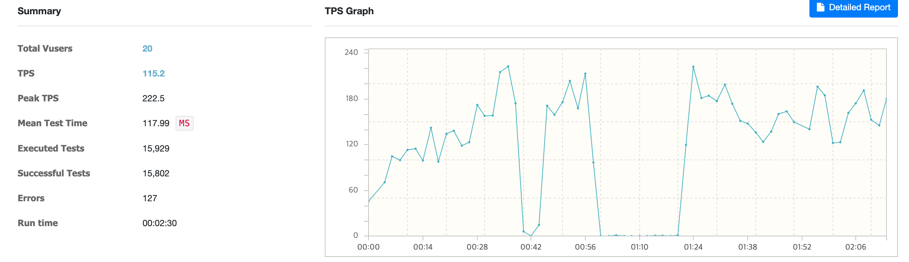
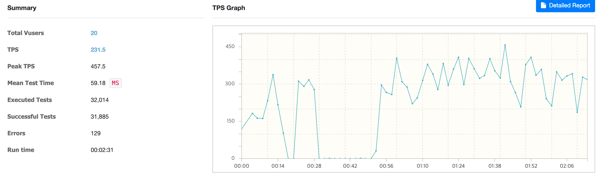

## 성능 최적화

## 1. nGrinder로 API 부하 테스트와 개선 과정

### 1. GET /tickets/available/{showtimeId} API에 대해 동시 요청을 보내는 nGrinder 스크립트를 작성하여 테스트를 실행.

<details>
    <summary>get 요청 nGrinder 스크립트</summary>

```groovy
import static net.grinder.script.Grinder.grinder
import static org.junit.Assert.*
import static org.hamcrest.Matchers.*
import net.grinder.script.GTest
import net.grinder.script.Grinder
import net.grinder.scriptengine.groovy.junit.GrinderRunner
import net.grinder.scriptengine.groovy.junit.annotation.BeforeProcess
import net.grinder.scriptengine.groovy.junit.annotation.BeforeThread

import org.junit.Before
import org.junit.BeforeClass
import org.junit.Test
import org.junit.runner.RunWith

import java.util.List
import java.util.ArrayList
import java.util.Random

import net.grinder.plugin.http.HTTPRequest
import net.grinder.plugin.http.HTTPPluginControl

import HTTPClient.Cookie
import HTTPClient.CookieModule
import HTTPClient.HTTPResponse
import HTTPClient.NVPair
import groovy.json.JsonOutput
import groovy.json.JsonSlurper

@RunWith(GrinderRunner)
class TestRunner {

    public static GTest test
    public static HTTPRequest request
    public static NVPair[] headers = []
    public static Cookie[] cookies = []

    @BeforeProcess
    public static void beforeProcess() {
        HTTPPluginControl.getConnectionDefaults().timeout = 6000
        test = new GTest(1, "Ticket Reservation Test")
        request = new HTTPRequest()

        List<NVPair> headerList = new ArrayList<>()
        headerList.add(new NVPair("Content-Type", "application/json"))
        headers = headerList.toArray()

        grinder.logger.info("Before process: Initialized HTTP request and headers.")
    }

    @BeforeThread
    public void beforeThread() {
        test.record(this, "test")
        grinder.statistics.delayReports = true
        grinder.logger.info("Before thread: Thread setup complete.")
    }

    @Before
    public void before() {
        request.setHeaders(headers)
        cookies.each { CookieModule.addCookie(it, HTTPPluginControl.getThreadHTTPClientContext()) }
        grinder.logger.info("Before test: Headers and cookies initialized.")
    }

    @Test
    public void test() {
        // Send GET request to retrieve available ticket IDs
        HTTPResponse getResponse = request.GET("http://host.docker.internal:8080/tickets/available/1")
        assertThat(getResponse.statusCode, is(200))

        // Parse the response to get the list of ticket IDs
        def jsonResponse = new JsonSlurper().parseText(getResponse.getText())
        def ticketIds = jsonResponse.ticketIds

        if (ticketIds.isEmpty()) {
            grinder.logger.error("사용 가능한 티켓이 없습니다.")
            return
        }

        // Randomly select some ticket IDs
        def random = new Random()
        def selectedTicketId = ticketIds.get(random.nextInt(ticketIds.size()))
		
		grinder.logger.info("i'm ready reservation ticketId: " + selectedTicketId)
    }
}
```
</details>

- 1-1. 처음 실행 후 결과

    - 평균 TPS가 약 115로 결과가 나옵니다.
</br></br>

- 1.2 Spring @Cacheable 수정 후 결과

  - 평균 TPS가 약 231으로 2배 가량 성능 개선을 확인할 수 있었습니다. 

```java
// 수정한 소스코드
@Cacheable("availableTickets")
@GetMapping("/available/{showtimeId}")
public ResponseEntity<AvailableTicketsDTO> getAvailableTickets(@PathVariable Long showtimeId) {
    return ResponseEntity.ok(ticketService.getAvailableTickets(showtimeId));
}
```

</br></br>

### 2. PUT /tickets/reservations API에 대해 동시 요청을 보내는 nGrinder 스크립트를 작성하여 테스트를 실행.

<details>
    <summary>get 요청 nGrinder 스크립트</summary>
위에서 작성한 GET 요청에 PUT 요청을 추가하였습니다.

```groovy
import static net.grinder.script.Grinder.grinder
import static org.junit.Assert.*
import static org.hamcrest.Matchers.*
import net.grinder.script.GTest
import net.grinder.script.Grinder
import net.grinder.scriptengine.groovy.junit.GrinderRunner
import net.grinder.scriptengine.groovy.junit.annotation.BeforeProcess
import net.grinder.scriptengine.groovy.junit.annotation.BeforeThread

import org.junit.Before
import org.junit.BeforeClass
import org.junit.Test
import org.junit.runner.RunWith

import java.util.List
import java.util.ArrayList
import java.util.Random

import net.grinder.plugin.http.HTTPRequest
import net.grinder.plugin.http.HTTPPluginControl

import HTTPClient.Cookie
import HTTPClient.CookieModule
import HTTPClient.HTTPResponse
import HTTPClient.NVPair
import groovy.json.JsonOutput
import groovy.json.JsonSlurper

@RunWith(GrinderRunner)
class TestRunner {

    public static GTest test
    public static HTTPRequest request
    public static NVPair[] headers = []
    public static Cookie[] cookies = []

    @BeforeProcess
    public static void beforeProcess() {
        HTTPPluginControl.getConnectionDefaults().timeout = 6000
        test = new GTest(1, "Ticket Reservation Test")
        request = new HTTPRequest()

        List<NVPair> headerList = new ArrayList<>()
        headerList.add(new NVPair("Content-Type", "application/json"))
        headers = headerList.toArray()

        grinder.logger.info("Before process: Initialized HTTP request and headers.")
    }

    @BeforeThread
    public void beforeThread() {
        test.record(this, "test")
        grinder.statistics.delayReports = true
        grinder.logger.info("Before thread: Thread setup complete.")
    }

    @Before
    public void before() {
        request.setHeaders(headers)
        cookies.each { CookieModule.addCookie(it, HTTPPluginControl.getThreadHTTPClientContext()) }
        grinder.logger.info("Before test: Headers and cookies initialized.")
    }

    @Test
    public void test() {
        // Send GET request to retrieve available ticket IDs
        HTTPResponse getResponse = request.GET("http://host.docker.internal:8080/tickets/available/1")
        assertThat(getResponse.statusCode, is(200))

        // Parse the response to get the list of ticket IDs
        def jsonResponse = new JsonSlurper().parseText(getResponse.getText())
        def ticketIds = jsonResponse.ticketIds

        if (ticketIds.isEmpty()) {
            grinder.logger.error("사용 가능한 티켓이 없습니다.")
            return
        }

        // Randomly select some ticket IDs
        def random = new Random()
        def selectedTicketId = ticketIds.get(random.nextInt(ticketIds.size()))

        // Prepare the POST request body
        def userId = random.nextInt(1000) + 1
        def requestBody = JsonOutput.toJson([
                userId    : userId,
                ticketIds : [selectedTicketId]
        ])

        grinder.logger.info("Request Body: ${requestBody}")

        HTTPResponse response = request.PUT(
                "http://host.docker.internal:8080/tickets/reservations",
                requestBody.getBytes("UTF-8")
        )

        grinder.logger.info("Response Code: ${response.statusCode}")

        assertThat(response.statusCode, is(200))
    }
}
```
</details>

2-1. 처음 실행 후 Error 발생 (약 700개 요청중 4개 에러 발생 - 0.57%)
```java
@Query(value = "SELECT * FROM ticket WHERE ticket_id IN (:ticketIds) AND status = 'AVAILABLE' FOR UPDATE NOWAIT", nativeQuery = true)
```
- 비관적 잠금 `NOWAIT`으로 인해 잠금을 얻지 못하는 예외처리를 제대로 처리하지 못하여 문제 발생
[safeticket] [nio-8080-exec-6] o.h.engine.jdbc.spi.SqlExceptionHelper   : SQL Error: 3572, SQLState: HY000
[safeticket] [nio-8080-exec-6] o.h.engine.jdbc.spi.SqlExceptionHelper   : Statement aborted because lock(s) could not be acquired immediately and NOWAIT is set.

2-2 해결방법: 예외처리를 수정하여 잠금을 얻지 못할 경우 500 Error가 아닌 200으로 처리 ( 에러 발생 - 0.00% )
```java
// ConcurrencyFailureException 예외를 추가
} catch (PessimisticLockException | ConcurrencyFailureException e) {
```


### 그라파나 참고 지표

- TPS (Transactions Per Second): 초당 처리되는 요청 수를 나타냅니다. 시스템의 처리 능력을 평가하는 중요한 지표입니다.  
- 응답 시간 (Response Time): 요청에 대한 응답 시간을 측정합니다. 평균 응답 시간, 95th 퍼센타일 응답 시간 등 다양한 응답 시간 지표를 모니터링할 수 있습니다.  
- 에러율 (Error Rate): 실패한 요청의 비율을 나타냅니다. 에러율이 높다면 시스템에 문제가 있을 가능성이 큽니다.  
- CPU 사용량 (CPU Usage): 서버의 CPU 사용량을 모니터링합니다. CPU 사용량이 높다면 성능 저하의 원인이 될 수 있습니다.  
- 메모리 사용량 (Memory Usage): 서버의 메모리 사용량을 모니터링합니다. 메모리 누수나 과도한 메모리 사용을 감지할 수 있습니다.  
- 디스크 I/O (Disk I/O): 디스크 입출력 활동을 모니터링합니다. 디스크 I/O가 높다면 디스크 병목 현상이 발생할 수 있습니다.  
- 네트워크 트래픽 (Network Traffic): 네트워크 입출력 활동을 모니터링합니다. 네트워크 대역폭 사용량을 확인할 수 있습니다.

